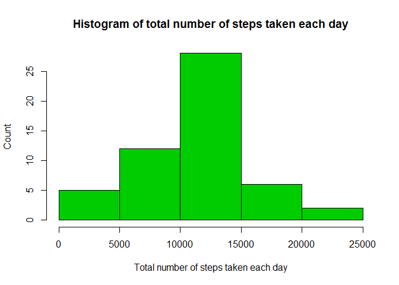
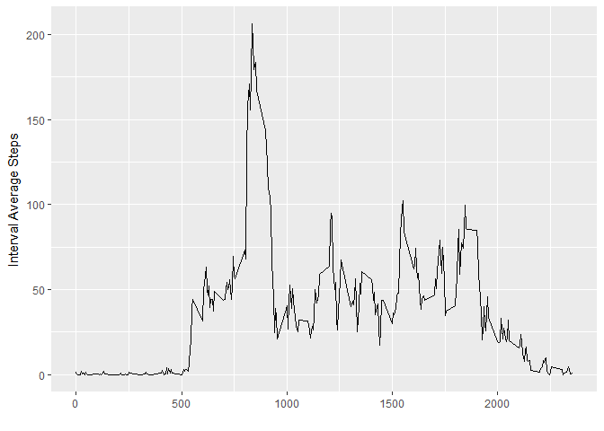
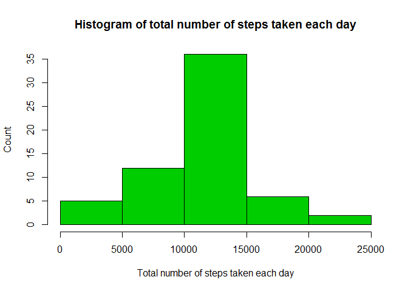
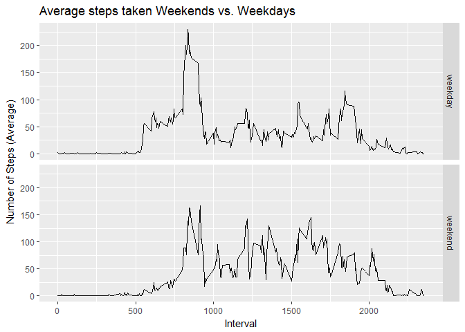

# Reproducible Research: Peer Assessment 1


## Loading and preprocessing the data
Load the required libraries. Read the data into R and clean it by formatting the dates and ignoring NAs.

```r
library(ggplot2)
library(dplyr)
data_steps_raw<-read.csv(file="activity.csv",header = TRUE)
data_steps<-na.omit(data_steps_raw)
data_steps$date<-as.Date(data_steps$date)
```


## What is mean total number of steps taken per day?
Calculate the total number of steps taken per day.

```r
daily_total_steps<-aggregate(data_steps$steps, by=list(Date=data_steps$date), FUN=sum)
```

Histogram of the total number of steps taken each day

```r
hist(daily_total_steps$x, 
     xlab="Total number of steps taken each day", 
     ylab="Count", 
     main="Histogram of total number of steps taken each day",
     col=3)
```

<!-- -->

mean and median of the total number of steps taken per day

```r
dailytotalstepsMean <- mean(daily_total_steps$x)
dailytotalstepsMedian <- median(daily_total_steps$x)
dailytotalstepsMean 
```

```
## [1] 10766.19
```

```r
dailytotalstepsMedian
```

```
## [1] 10765
```

## What is the average daily activity pattern?

A time series plot (i.e. type = "l") of the 5-minute interval (x-axis) and the average number of steps taken, averaged across all days (y-axis)


```r
IntervalAverage <- aggregate(data_steps$steps,by=list(Interval=data_steps$interval),FUN=mean)

ggplot(IntervalAverage, aes(Interval, x)) + geom_line() + xlab("") + ylab("Interval Average Steps")
```

<!-- -->

Which 5-minute interval, on average across all the days in the dataset, contains the maximum number of steps?

```r
maxstepinterval <- IntervalAverage$Interval[which.max(IntervalAverage$x)]
maxstepinterval
```

```
## [1] 835
```

## Imputing missing values

The total number of missing values in the dataset

```r
missing <- sum(is.na(data_steps_raw$steps))
missing
```

```
## [1] 2304
```


Filling all the missing values in the dataset by mean of the 5 minute interval.

```r
data_steps_fill <- data_steps_raw
for (i in 1:nrow(data_steps_fill)) {
  if (is.na(data_steps_fill$steps[i])) {
    index <- which(data_steps_fill$interval[i] == IntervalAverage$Interval)
    data_steps_fill$steps[i] <- IntervalAverage[index,]$x
  }
}
data_steps_fill$date <- as.Date(data_steps_fill$date)

daily_total_steps_fill<-aggregate(data_steps_fill$steps, by=list(Date=data_steps_fill$date), FUN=sum)
```


Histogram of the total number of steps taken each day after missing values are imputed.

```r
hist(daily_total_steps_fill$x, 
     xlab="Total number of steps taken each day", 
     ylab="Count", 
     main="Histogram of total number of steps taken each day",
     col=3)
```

<!-- -->

mean and median total number of steps taken per day after missing values are imputed.


```r
dailytotalstepsMeanFill <- mean(daily_total_steps_fill$x)
dailytotalstepsMedianFill <- median(daily_total_steps_fill$x)
dailytotalstepsMeanFill
```

```
## [1] 10766.19
```

```r
dailytotalstepsMedianFill
```

```
## [1] 10766.19
```

The impact of imputing missing data on the estimates of the total daily number of steps is that the mean of daily number of steps remains the same but the median changes and becomes same as mean. This also implies that the activity pattern is symmetric. 

## Are there differences in activity patterns between weekdays and weekends?

Create a new factor variable in the dataset with two levels - "weekday" and "weekend" indicating whether a given date is a weekday or weekend.

```r
data_steps_fill$days<-weekdays(data_steps_fill$date)
data_steps_fill$daytype<-"weekday"
data_steps_fill$daytype[data_steps_fill$days %in% c("Saturday", "Sunday")] <- "weekend"

dayaverage <- data_steps_fill %>%  group_by(daytype, interval) %>%  summarize(AverageSteps=mean(steps))
```

Make a panel plot containing a time series plot (i.e.type = "l") of the 5-minute interval (x-axis) and the average number of steps taken, averaged across all weekday days or weekend days (y-axis). 

```r
qplot(interval, AverageSteps, data=dayaverage,type="l", geom="line",xlab="Interval",ylab="Number of Steps (Average)",main="Average steps taken Weekends vs. Weekdays",facets =daytype ~ .)
```

<!-- -->
